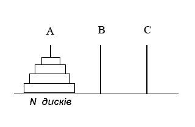

# Домашнє завдання до теми “Рекурсивні функції, алгоритми та приклади їх застосування”

Вітаємо! Як настрiй? Сподiваємося, що ви з нетерпiнням потираєте руки, очікуючи на новий челлендж 😉

Рекурсія, як ключовий аспект програмування, відкриває двері до безмежних можливостей та використовується в різноманітних завданнях. Сьогодні ви отримаєте навички створення рекурсивних алгоритмів та вміння застосовувати рекурсивні методи при вирішенні задач, а саме:

- виконаєте рекурсивне сортування файлів у директорії, що не лише розширить ваші навички управління файловою системою, але й допоможе зрозуміти, як рекурсія може бути потужним інструментом для опрацювання структурних даних;

- візуалізуєте фрактал «сніжинка Коха» за допомогою рекурсії, розкривши великий потенціал цього принципу в мистецтві генерації складних структур;

- за бажанням напишите програму, яка виконує переміщення дисків за зазначеними правилами і виводить кожен крок переміщення, що допоможе вам розвинути розуміння роботи алгоритмів рекурсії та роботи зі стеками.

Рекурсія — це не просто програмістський термін, це магія, яка дозволяє функціям викликати самих себе, розширюючи можливості програм та дозволяючи розв'язувати завдання більш ефективним чином. Опановуючи рекурсію, ви вчитеся думати про завдання у більш гнучкий та елегантний спосіб.

Нехай це домашнє завдання розширить вашу перспективу на світ рекурсивного програмування! 🧠

## Опис домашнього завдання

### Завдання 1

Напишіть програму на Python, яка рекурсивно копіює файли у вихідній директорії, переміщає їх до нової директорії та сортує в піддиректорії, назви яких базуються на розширенні файлів.

Також візьміть до уваги наступні умови:

1. **Парсинг аргументів:**

- Скрипт має приймати два аргументи командного рядка: шлях до вихідної директорії та шлях до директорії призначення (за замовчуванням, якщо тека призначення не була передана, вона повинна бути з назвою `dist`).

2. **Рекурсивне читання директорій:**

- Має бути написана функція, яка приймає шлях до директорії як аргумент.
- Функція має перебирати всі елементи у директорії.
- Якщо елемент є директорією, функція повинна викликати саму себе рекурсивно для цієї директорії.
- Якщо елемент є файлом, він має бути доступним для копіювання.

3. **Копіювання файлів:**

- Для кожного типу файлів має бути створений новий шлях у вихідній директорії, використовуючи розширення файлу для назви піддиректорії.
- Файл з відповідним типом має бути скопійований у відповідну піддиректорію.

4. **Обробка винятків:**

- Код має правильно обробляти винятки, наприклад, помилки доступу до файлів або директорій.

### Завдання 2

Напишіть програму на Python, яка використовує рекурсію для створення фракталу «сніжинка Коха» за умови, що користувач повинен мати можливість вказати рівень рекурсії.

### Завдання 3 (необов'язкове завдання). Ханойські башти

Напишіть програму, яка виконує переміщення дисків з стрижня `А` на стрижень `С`, використовуючи стрижень `В` як допоміжний. Диски мають різний розмір і розміщені на початковому стрижні у порядку зменшення розміру зверху вниз.



**Правила:**

1. За один крок можна перемістити тільки один диск.

2. Диск можна класти тільки на більший диск або на порожній стрижень.

Вхідними даними програми має бути число n — кількість дисків на початковому стрижні. Вихідними даними — логування послідовності кроків для переміщення дисків зі стрижня А на стрижень С.

Наведемо приклад виконання коду для кількості дисків `n = 3`. На початковому стрижні вони розміщені так: `[3, 2, 1]`, де `3` — найбільший диск, а `1` — найменший.

```Python
Початковий стан: {'A': [3, 2, 1], 'B': [], 'C': []}
Перемістити диск з A на C: 1
Проміжний стан: {'A': [3, 2], 'B': [], 'C': [1]}
Перемістити диск з A на B: 2
Проміжний стан: {'A': [3], 'B': [2], 'C': [1]}
Перемістити диск з C на B: 1
Проміжний стан: {'A': [3], 'B': [2, 1], 'C': []}
Перемістити диск з A на C: 3
Проміжний стан: {'A': [], 'B': [2, 1], 'C': [3]}
Перемістити диск з B на A: 1
Проміжний стан: {'A': [1], 'B': [2], 'C': [3]}
Перемістити диск з B на C: 2
Проміжний стан: {'A': [1], 'B': [], 'C': [3, 2]}
Перемістити диск з A на C: 1
Проміжний стан: {'A': [], 'B': [], 'C': [3, 2, 1]}
Кінцевий стан: {'A': [], 'B': [], 'C': [3, 2, 1]}
```

## Підготовка та завантаження домашнього завдання

1. Створіть публічний репозиторій `goit-algo-hw-03`.

2. Виконайте завдання та відправте його у свій репозиторій.

3. Завантажте робочі файли на свій комп’ютер та прикріпіть їх в LMS у форматі `zip`. Назва архіву повинна бути у форматі ДЗ3_ПІБ.

4. Прикріпіть посилання на репозиторій `goit-algo-hw-03` та відправте на перевірку.

> [!IMPORTANT]
>
> 💡 ВАЖЛИВО Перегляньте Інструкцію щодо завантаження робочого файлу з репозиторію на Github

## Формат здачі

- Прикріплені файли репозиторію у форматі `zip` з назвою ДЗ3_ПІБ.
- Посилання на репозиторій.

## Критерії прийняття ДЗ

Прикріплені посилання на репозиторій `goit-algo-hw-03` та безпосередньо самі файли репозиторію у форматі `zip`.

**Завдання 1:**

1. Парсинг аргументів. Скрипт приймає два аргументи командного рядка: шлях до вихідної директорії та шлях до директорії призначення (за замовчуванням, якщо тека призначення не була передана, вона повинна бути з назвою `dist`).

2. Рекурсивне читання директорій:

- Написана функція, яка приймає шлях до директорії як аргумент.
- Функція перебирає всі елементи у директорії.
- Якщо елемент є директорією, функція викликає саму себе рекурсивно для цієї директорії.
- Якщо елемент є файлом, він є обробленим для копіювання.

3. Копіювання файлів:

- Для кожного типу файлів створюється новий шлях у вихідній директорії, використовуючи розширення файлу для назви піддиректорії.
- Файл з відповідним типом копіюється у відповідну піддиректорію.

4. Обробка винятків: код правильно обробляє винятки, наприклад, помилки доступу до файлів або директорій.

5. Після виконання програми всі файли у вихідній директорії рекурсивно скопійовано в нову директорію та розсортовано в піддиректорії за їх розширенням.

**Завдання 2:**

1. Код виконується. Програма візуалізує фрактал «сніжинка Коха».

2. Користувач має можливість вказати рівень рекурсії.

**Завдання 3 (необов'язкове завдання):**

Завдання є додатковим, тому не оцінюється, проте, за бажанням, ви можете отримати конструктивний зворотний зв’язок від ментора.

## Формат оцінювання

Залік/незалік
